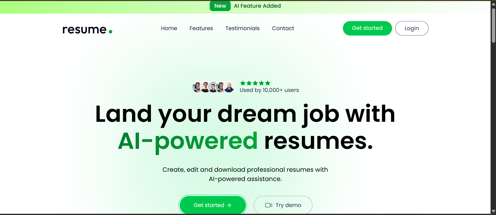
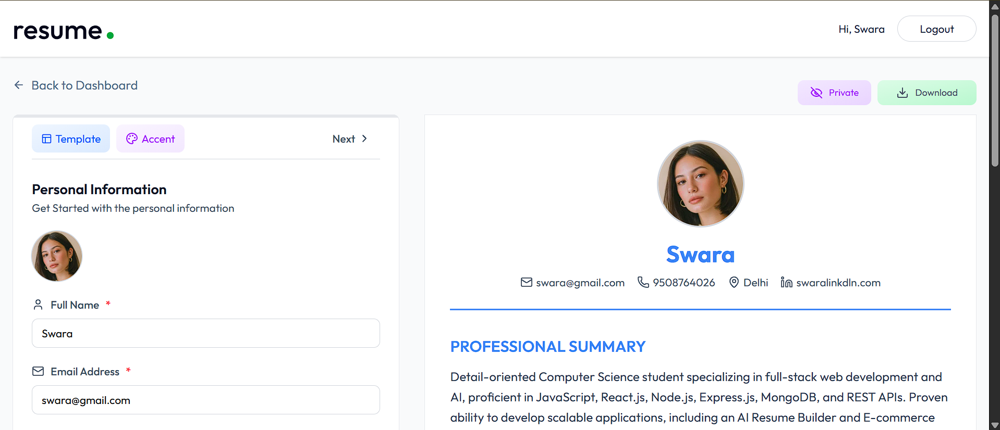
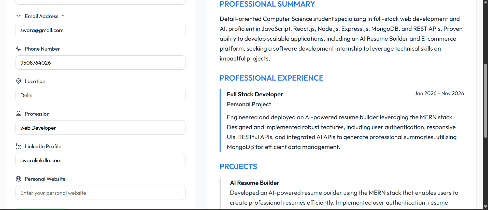
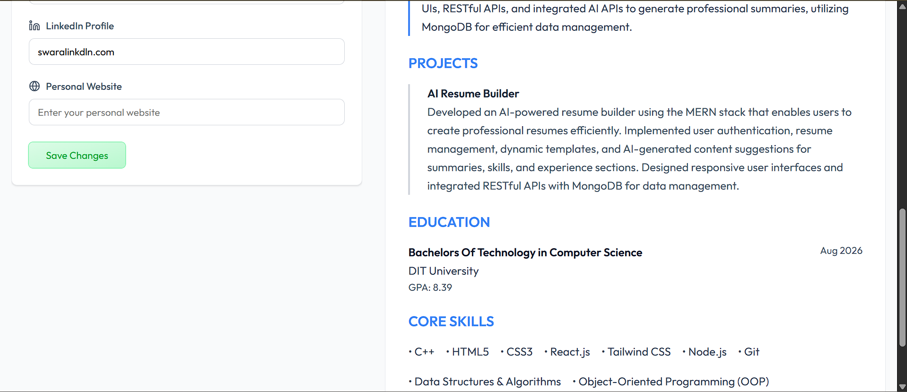

# ResumeAI - AI Resume Builder

## Overview

ResumeAI is a full-stack MERN application that helps users create professional resumes with AI-powered assistance. The platform allows users to build, edit, manage, and organize multiple resumes through a clean and responsive interface.

This project was developed to simplify the resume creation process and provide users with an efficient way to generate professional resumes.

---

## Features

* User Authentication (Login & Signup)
* Create and Manage Multiple Resumes
* Professional Resume Templates
* AI-Powered Resume Content Assistance
* Real-Time Resume Editing
* Responsive User Interface
* Secure Data Storage with MongoDB
* Resume Preview Functionality
* Resume Download Support

---

## Screenshots

### Home Page



### Dashboard - Overview



### Dashboard - Resume Management



### Dashboard - Additional View



---

## Tech Stack

### Frontend

* React.js
* Vite
* Tailwind CSS

### Backend

* Node.js
* Express.js

### Database

* MongoDB

### Authentication

* JWT (JSON Web Tokens)

### Tools

* Git
* GitHub
* VS Code
* Postman

---

## Project Structure

```text
resumeai/
│
├── client/
├── server/
├── screenshots/
├── README.md
└── LICENSE
```

---

## Installation

### Clone Repository

```bash
git clone <your-github-repository-url>
```

### Install Frontend Dependencies

```bash
cd client
npm install
```

### Install Backend Dependencies

```bash
cd ../server
npm install
```

### Run Frontend

```bash
npm run dev
```

### Run Backend

```bash
npm start
```

---

## Future Enhancements

* ATS Resume Score Checker
* Cover Letter Generator
* Additional Resume Templates
* AI Resume Suggestions
* Resume Sharing Features
* AI Interview Preparation Assistant

---

## Learning Outcomes

Through this project, I gained practical experience in:

* Full-Stack MERN Development
* REST API Development
* Authentication & Authorization
* Database Design with MongoDB
* Responsive UI Development
* Git & GitHub Version Control
* Project Deployment

---

## Author

**Nidhi Kumari**

Aspiring Full-Stack Developer passionate about building modern web applications and solving real-world problems through technology.

---

## License

This project is intended for educational and portfolio purposes.
